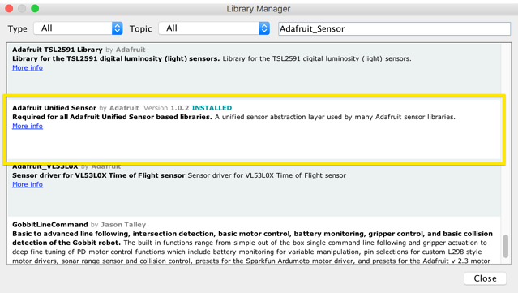
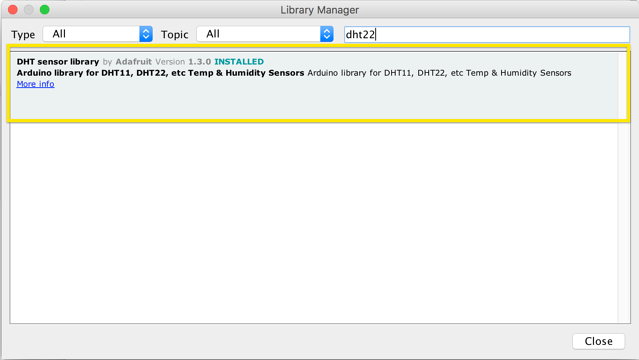

# Sensor Test

## installation
In addition to this, you'll have to install two more libraries. To read the sensor, we are going to use Adafruit's DHT22 library. It can be installed using Arduino's library manager. It comes in two components. First, you'll want to download the Adafruit Unified Sensor library: 

Then, install the DHT sensor library:
